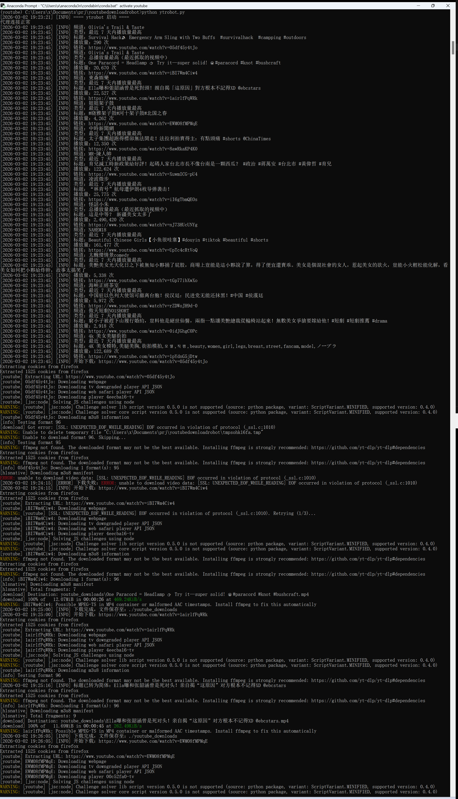

# ytrobot — 订阅频道热门视频自动下载

从你的 YouTube 订阅频道中，按「最近 7 天播放量最高」和「总播放量最高」筛选视频，并用 yt-dlp 自动下载，避免重复下载（仅下载体积小于 1 GB 的视频）。

## 功能概览

- **OAuth 登录**：使用 Google OAuth 读取你的订阅列表（只读权限）
- **智能筛选**：对每个订阅频道取最近若干条视频，选出「一周内播放最高」和「总播放最高」各一条
- **自动下载**：用 yt-dlp 下载，标题可转为简体，并生成同名 `.info.json`
- **去重记录**：已下载视频写入 `downloaded_videos.json`，下次运行自动跳过
- **代理支持**：支持 SOCKS5（需 PySocks）及 HTTP/HTTPS 代理；OAuth 刷新/首次授权时会临时直连 Google

## 环境要求

- Python 3.7+（本项目实际在 Anaconda 创建的 Python 3.12 虚拟环境中测试通过）
- Node.js（用于 yt-dlp 的 `js_runtimes=node`，未安装时通常也能正常工作）

## 安装依赖

```bash
pip install google-api-python-client google-auth google-auth-oauthlib google-auth-httplib2 yt-dlp
```

使用 SOCKS5 代理时还需：

```bash
pip install PySocks
```

可选（标题繁体转简体）：

```bash
pip install zhconv
```

## 配置

### 1. Google OAuth 客户端

1. 打开 [Google Cloud 控制台](https://console.cloud.google.com/)
2. 创建或选择项目 → 启用 **YouTube Data API v3**
3. 凭据 → 创建凭据 → OAuth 2.0 客户端 ID → 应用类型选「桌面应用」
4. 下载 JSON，重命名为 `client_secret.json`，放在脚本同目录

### 2. 首次授权

首次运行会打开浏览器，用你的 Google 账号登录并授权。授权完成后会生成 `token.json`


### 3. config.json

在脚本同目录创建 `config.json`，例如：

```json
{
  "proxy": "socks5://127.0.0.1:10809",
  "cookies_from_browser": "firefox",
  "douyin_max_uploads_per_24h": 10,
  "douyin_interval_min_hours": 0.5,
  "douyin_interval_max_hours": 2,
  "ytrobot_interval_hours": 24
}
```

- **proxy**：代理地址。`socks5://...` 会在程序启动时通过 PySocks 全局生效；其他类型会设置 `HTTP_PROXY`/`HTTPS_PROXY`（仅对部分库有效）。
- **cookies_from_browser**：从浏览器读取 Cookie 供 yt-dlp 使用，如 `chrome`、`firefox` 等，按 yt-dlp 文档填写。注：运行程序时对应浏览器要关闭，因为 cookie 会被锁定。建议用不常用的如 firefox 做为专门下载视频用。
- **douyin_max_uploads_per_24h**：24 小时内最多上传到抖音的视频数量（默认 10）。
- **douyin_interval_min_hours** / **douyin_interval_max_hours**：每两个视频之间的随机间隔范围（小时），默认 0.5～2。
- **ytrobot_interval_hours**：ytrobot 每轮下载完成后等待多少小时再下一轮（默认 24）。

### 4. email_config.json（可选）

用于抖音上传「剩余视频数量」邮件提醒。当待上传视频剩余 5、4、3、2、1 个时会发邮件到 `EMAIL_USERNAME` 对应邮箱。在项目根目录创建 `email_config.json`：

```json
{
  "EMAIL_NOTIFY_ENABLED": true,
  "EMAIL_SMTP_HOST": "smtp.qq.com",
  "EMAIL_SMTP_PORT": 465,
  "EMAIL_USE_TLS": false,
  "EMAIL_USERNAME": "你的邮箱@qq.com",
  "EMAIL_PASSWORD": "SMTP 授权码"
}
```

QQ 邮箱需在设置中开启 SMTP 并使用授权码。运行 `python test_email.py` 可测试邮件发送。

## 目录与文件说明

| 文件/目录 | 说明 |
|-----------|------|
| `ytrobot.py` | 下载主程序（持续运行，按 `ytrobot_interval_hours` 定时下载；仅下载小于 1 GB 的视频） |
| `ytdl.py` | 单个视频下载脚本 |
| `uploaddy.py` | 抖音上传主程序（常驻运行，扫描 `youtube_downloads/` 中的 mp4 并上传，剩余 ≤5 个时可邮件提醒） |
| `douyin_login.py` | 抖音登录脚本，生成 `cookies/douyin_uploader/account.json` |
| `test_email.py` | 邮件发送测试脚本 |
| `conf.py` | 抖音上传、邮件等基础配置（浏览器路径等） |
| `utils/` | 上传相关的通用工具（日志、Playwright 初始化等） |
| `uploader/` | 各平台上传实现，这里只用到了 `douyin_uploader` |
| `config.json` | 代理、下载/上传间隔等配置 |
| `email_config.json` | 邮件提醒配置（SMTP、邮箱等），可选 |
| `client_secret.json` | Google OAuth 客户端密钥（需自行创建） |
| `token.json` | OAuth 令牌（首次授权后生成） |
| `youtube_tokens.json` | 可由 gettoken 等工具生成，与 token.json 二选一 |
| `downloaded_videos.json` | 已下载视频记录（id、标题、播放量、时间、文件名） |
| `data/douyin_uploaded.json` | 已上传抖音的视频记录（path、uploaded_at） |
| `youtube_downloads/` | 默认下载目录（可在调用时修改） |
| `ytrobot.log` | 下载日志（按天滚动，保留 7 天） |
| `uploaddy.log` | 抖音上传日志（按天滚动，保留 7 天） |

### 抖音上传相关依赖

自动上传抖音依赖：

```bash
pip install playwright loguru
playwright install
```

默认使用 Playwright 自带的 Chromium；如需指定本机 Chrome 可在 `conf.py` 中设置 `LOCAL_CHROME_PATH`。

### 抖音登录与上传

- **首次/更新登录：**
  ```bash
  python douyin_login.py
  ```
  按提示在打开的浏览器中登录抖音创作者中心，完成后会在 `cookies/douyin_uploader/account.json` 生成/更新登录状态。

- **自动上传抖音：**
  ```bash
  python uploaddy.py
  ```
  常驻运行，定期扫描 `youtube_downloads/` 中未上传过的 mp4，通过同名 `.info.json` 的标题和标签作为抖音标题与话题上传；  
  若 cookie 不存在或失效，会自动触发浏览器登录一次；全部上传完后每隔 60 秒重新检查是否有新视频。  
  在 `config.json` 中可配置：`douyin_max_uploads_per_24h`（24 小时内最多上传数量，默认 10）；`douyin_interval_min_hours` / `douyin_interval_max_hours`（每两个视频之间的间隔随机范围，默认 0.5～2 小时）。上传失败的视频不会写入已上传记录，下次会重试。  
  当待上传视频剩余 5、4、3、2、1 个时会发送邮件提醒（需在 `email_config.json` 中配置并开启 `EMAIL_NOTIFY_ENABLED`）。

## 运行方式

### 下载（ytrobot）

```bash
python ytrobot.py
```


ytrobot 会**持续运行**，按 `config.json` 中的 `ytrobot_interval_hours`（默认 24 小时）定时执行下载。流程简述：

1. 读取 `config.json`，设置代理并检查连通性（仅 SOCKS5 会做连接测试）
2. 使用 `token.json` 或 `youtube_tokens.json` 获取 OAuth 凭据，必要时刷新或启动本地授权（端口 8080）
3. 拉取订阅列表（最多 `MAX_SUBSCRIPTIONS` 个频道），每个频道取最近 `VIDEOS_PER_CHANNEL` 条视频
4. 为每个频道计算「最近 7 天播放最高」和「总播放最高」，去重后得到待下载列表
5. 跳过已在 `downloaded_videos.json` 中的视频，用 yt-dlp 下载到 `youtube_downloads/`（仅下载小于 1 GB 的视频）
6. 下载成功后追加一条记录到 `downloaded_videos.json`
7. 等待 `ytrobot_interval_hours` 小时后重复上述流程

### 上传（uploaddy）

```bash
python uploaddy.py
```
常驻运行，扫描 `youtube_downloads/` 中未上传的 mp4 并上传到抖音，全部上传完后每 60 秒重新检查。

## 程序内常量（可改）

在 `ytrobot.py` 顶部可调整：

- `MAX_SUBSCRIPTIONS`：最多使用多少个订阅频道（默认 30）
- `VIDEOS_PER_CHANNEL`：每个频道取最近多少条视频参与筛选（默认 5）
- `MAX_VIDEO_SIZE_BYTES`：只下载小于此体积的视频（默认 1 GB，即 `1024 ** 3` 字节）

## 常见问题

- **8080 端口被占用**：关闭占用 8080 的其他程序，或只保留一个 ytrobot 运行实例，避免多次授权导致 state 混乱。
- **代理下 OAuth 失败**：程序在刷新 token 和首次授权时会暂时关闭代理直连 Google；若仍失败，可检查本机直连 Google 是否正常。
- **代理连接失败**：确认代理软件已开启，且 `config.json` 中的端口（如 10809）与代理的 SOCKS5 端口一致。
- **下载失败**：可配置 `cookies_from_browser`，或检查 yt-dlp 与 YouTube 的访问策略（如地区、登录状态）。

## 许可证

按项目仓库约定使用。

联系qq:2641550239